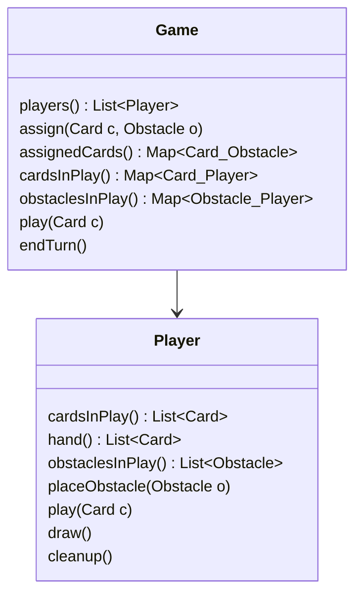
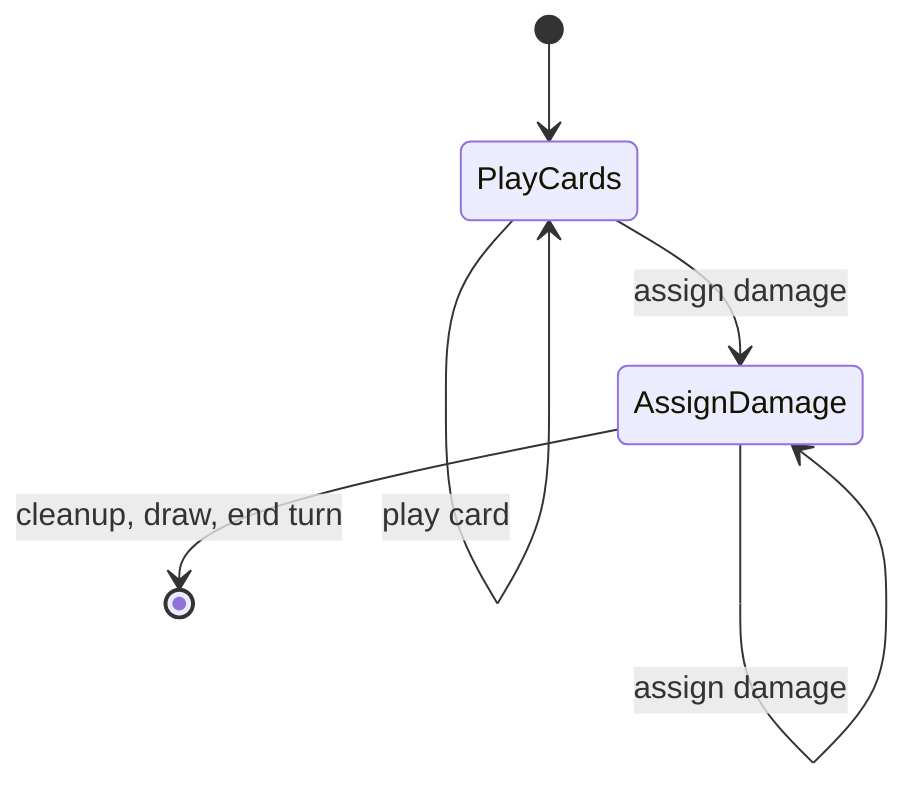
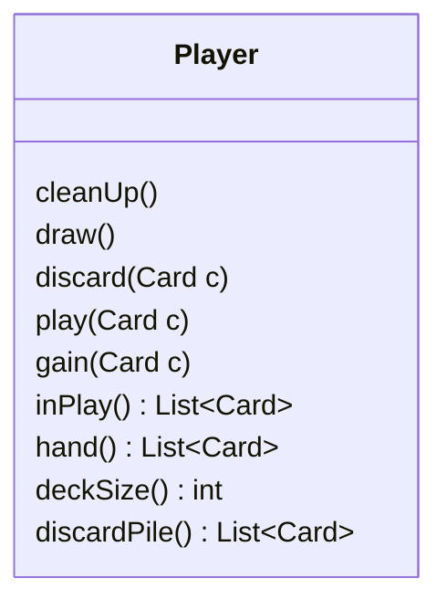
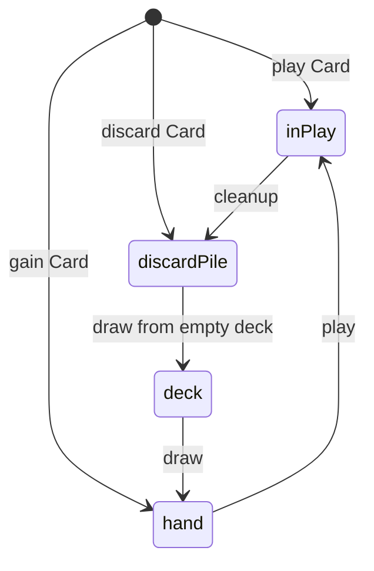
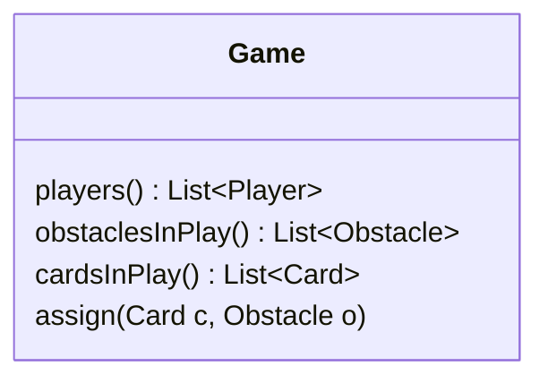

# Task

## Cooperative Card Game

### 0 - Basic Specification 
After setup, the game is played over a series of turns.
The game is played by two players.
During setup, determine a starting player.
Additionally, each player starts with an obstacle in their play area.
Further each player starts the game without cards in hand.
Then players take alternating turns.
As the active player you take the following steps in order:

1. **play cards**: put zero or more cards from your hand into your play area
2. **assign damage**: assign damage from cards in play to any of the obstacles in play
3. **end**:
   - *draw*: add two new cards to your hand
   - *clean up*: remove played cards and cleared obstacles
   - *activate next player*

The players win as soon as all obstacles are cleared.
That means the players cannot lose.

#### Cards
Cards have a name and an amount of damage they can deal to
an obstacle. Two cards with the same name feature the same amount of damage.

#### Obstacles
Obstacles feature a track of damage levels.
An obstacle is cleared once all levels have been cleared.
A level is cleared once its preceding level is cleared and the specified
amount of damage has been assigned to it.

#### Design

### 1 - Basic Specification

#### Game Structure

After setup, the game is played over a series of turns.
The game is played by two players.
During setup, determine a starting player and put two **obstacles** into play.
Further each player starts the game with 3 cards in hand and a deck of 7 cards.
Then players take alternating turns.
As the active player you take the following steps in order:

1. **play cards**: put zero or more cards from your hand into play
2. **assign damage**: assign damage from cards in play to any of the obstacles in play
3. **cleanup**: put played cards onto your discard pile and remove cleared obstacles from the game
3. **draw**: add two cards from your deck to your hand. As soon as you would draw a card from an empty deck, move the
   cards from your discard pile to your deck.
3. **end**: end your turn, the other player now becomes the active player and starts her turn

#### Card Anatomy

Each player card has a name and an id.
Additionally, each player card denotes the amount of damage it can deal to an obstacle.
The id uniquely identifies each card, i.e., at any point there should be exactly as many
ids as cards.
Two cards with the same name feature the same amount of damage, but can have a different id.

For our prototype we consider only two card types:

| **Name**   | Quick Shot | Hack |
|------------|------------|------|
| **Damage** | 2          | 1    |

Each player starts with five copies of each, three **Hack** in hand and the other cards in arbitrary order in the deck.

#### Obstacle Anatomy and Assigning Damage

Similar to cards, obstacles have name and id.
As for the cards two obstacles with the same name are considered equal in all aspects but their ids.
Obstacles feature a damage track. That track consists of a sequence of levels.
To clear the obstacle each of these levels has to be cleared in order, from first to last.
Each level specifies the amount of damage that needs to be assigned to clear it.
Damage from one card can be used for different levels but only for a single obstacle, ie., damage from a
single card cannot be spread across different obstacles.

| **Name**    | Lightning Mage   | Security Chief |
|-------------|------------------|----------------|
| **Level 1** | 3                | 4              |
| **Level 2** | 5                | 3              |
| **Level 3** | 4                | 2              |

During the **cleanup** phase damage from all levels that are not fully cleared is healed.
A level is not fully cleared if any of the two conditions below applies

* the preceding level is not cleared
* not all required damage has been assigned

#### Game End

As soon as all obstacles have been cleared the game ends after the active players cleanup phase.
*Note*: In this prototype there is no way for the players to lose the game.

# Design Rational

## Analysis

A card can be at one of the following places:

- player's deck
- player's hand
- player's discard pile
- play area

We expect the following changes

* more phases
* changed behaviour for phases
* more player cards and obstacles
* almost arbitrary game altering effects for player cards and obstacles

### Card Traits

- A physical card exists exactly once.
- Putting it into a players hand should remove from the deck.
- Putting it into the deck should remove it from the discard pile, etc.

### Phases

### Classes

#### Player

A player manages three sets of cards: discardPile, deck and hand.

