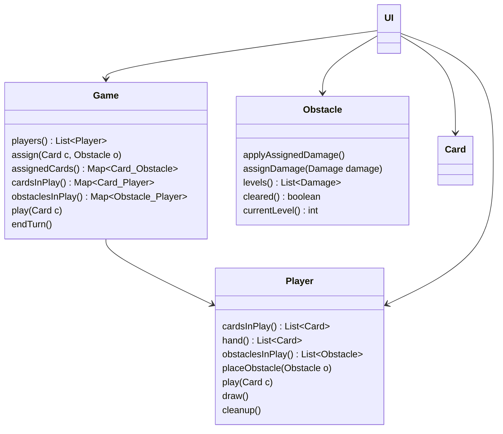

# Cooperative Card Game

## 0 - Basic Specification 
After setup, the game is played over a series of turns.
The game is played by two players.
During setup, determine a starting player.
Additionally, each player starts with an obstacle in their play area.
Further each player starts the game without cards in hand.
Then players take alternating turns.
As the active player you take the following steps in order:

1. **play cards**: put zero or more cards from your hand into your play area
2. **assign damage**: assign damage from cards in play to any of the obstacles in play
3. **end**:
   - *draw*: add two new cards to your hand
   - *clean up*: remove played cards and cleared obstacles
   - *activate next player*

The players win as soon as all obstacles are cleared.
That means the players cannot lose.

#### Cards
Cards have a name and an amount of damage they can deal to
an obstacle. Two cards with the same name feature the same amount of damage.

#### Obstacles
Obstacles feature a track of damage levels.
An obstacle is cleared once all levels have been cleared.
A level is cleared once its preceding level is cleared and the specified
amount of damage has been assigned to it.

#### Design

# Feature Additions

## 1 - Decks of Cards
- Each Player starts the game with a deck of 7 cards and 3 cards in hand
- At the end of turn, the active player draws two cards from her deck
- Each card in the game has a unique numeric id
- At the end of turn, cards played by a player are placed onto that players discard pile 
- If a player drew from an empty deck the discard pile (is shuffled and) forms a new deck that remaining cards are drawn from

The cards have the following attributes:

| Name          | Damage                                        |
|---------------|-----------------------------------------------|
| Street Smarts |  Red: 1, Black: 0, Blue: 0, Green: 0, Gray: 0 |

During implementation keep an eye out for the impact that these changes have on
your tests as well. Don't forget to treat the tests with the same care as the production
code. Thus the tests may be subject to refactoring and application of design
patterns just as well as the production code.

